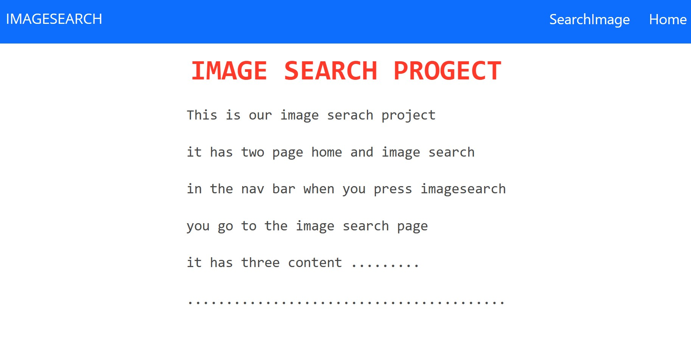
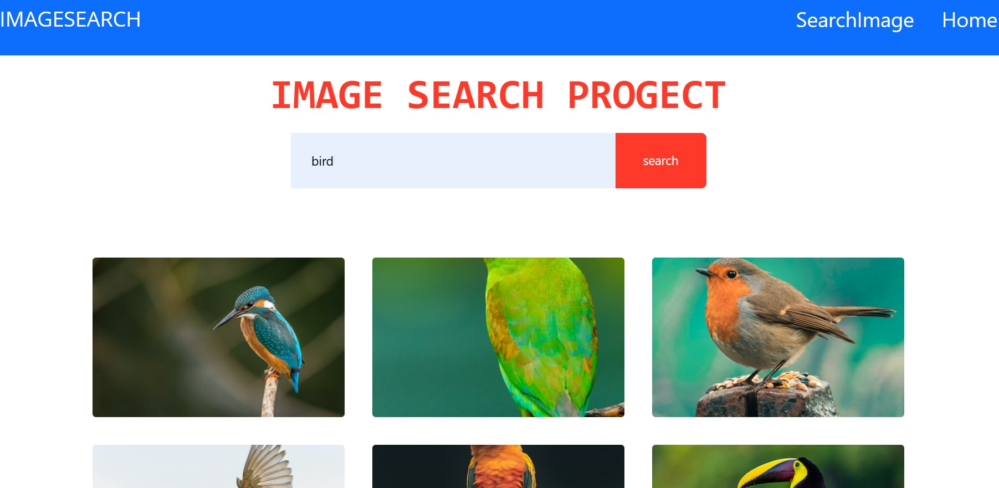
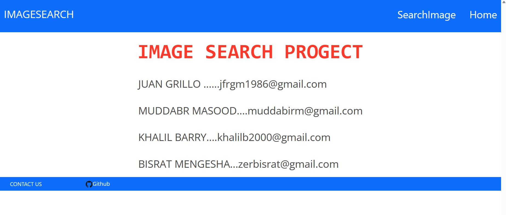

1. Project Name
​
Image Search Project
​
2. Project Description
​
This is an image search project with two pages: home and image search. The home page contains information about the project, and when you click on "SearchImage" in the navigation bar, you are directed to the image search page. The image search page allows you to search for images using a keyword and displays the search results as thumbnails. You can click on the thumbnails to view the full-size images. The project uses the Unsplash API for image search.
​
3. Technologies Used
​
	a. HTML
​
	b. CSS (Bootstrap, Bulma)
​
	c. JavaScript
​
4. Table of Contents
​
	a. How to Install the Project
	
	b. How to Use the Project
	
5. How to Install the Project
​
		a. To install and run the project, follow these steps:
​
		I. Click on GitHub repository link:
​
		"GitHub Link"        
​
		II. Click on deployed website link:
​
		"Live Deployed page link"
​
	b. Running the project locally
​
		I. Clone the repository to your local machine.
		
		II. Open the `index.html` file in a web browser.
​
6. How to Use the Project
​
	a. HTML 1 (Image Search Page)
	
		I. Open the index.html file in your web browser to access the image search page.
		
		II. The page contains a navigation bar with links to the home page and other sections.
		
		III. Enter a keyword in the search box and click the "Search" button to search for images related to the keyword.
		
		VI. The search results will be displayed as thumbnails. Click on a thumbnail to view the full-size image.
		
		V. If you want to see more images related to the same keyword, click the "Show More" button at the bottom.
​
	b. HTML 2 (GIF Search Page)
	
		I. Open the gif_search.html file in your web browser to access the GIF search page.
		
		II. The page contains an input field where you can enter a search term for GIFs.
		
		III. Press the "Enter" key or click the "Search!" button to perform the GIF search.
		
		VI. The search results will be displayed as GIFs.
​
7. Screenshot:
​
	
​
  

  
​

 
